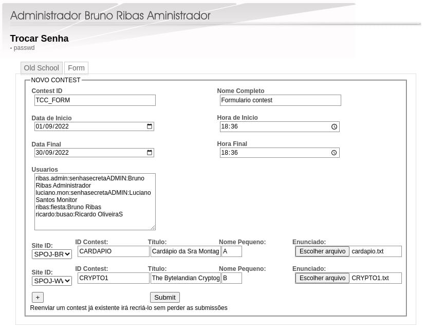

Esta documentação procura orientar todos os interessados em executar uma instância do cd-moj ou contribuir.

# Site

## Instalação   

### Instalando pré-requisitos

```bash
$ apt update
$ apt install gcc git apache2 rsync xclip curl default-jre default-jdk openjdk-17-jre openjdk-17-jdk
```
### Instalando cd-moj

```bash
$ mkdir $HOME/cdmoj
$ mkdir $HOME/cdmoj/moj
$ mkdir $HOME/cdmoj/tmp

$ git clone https://github.com/cd-moj/cdmoj.git
$ cd cdmoj
$ chmod +x install.sh
$ bash install.sh $HOME/cdmoj/moj-serverside $HOME/cdmoj/moj-pagina 
```

### Configurando cd-moj

#### Configurando apache cgi-bin

Primeiramente acesse o arquivo de configuração do apache:

```bash
$ sudo nano /etc/apache2/apache2.conf
```

Adicione as seguintes linhas no final do arquivo:

```apache
  <Directory /home/cdmoj/moj-pagina/>
      Options +ExecCGI
      AddHandler cgi-script .cgi .sh
  </Directory>
```

Execute o seguinte comando para permitir que o apache execute cgi:

```bash
$ sudo ln -s /etc/apache2/mods-available/cgi.load /etc/apache2/mods-enabled/cgi.load
```

Acesse o arquivo do servidor cgi-bin:

```bash
$ sudo nano /etc/apache2/conf-available/serve-cgi-bin.conf
```

Dentro desse arquivo há um trecho parecido com esse:

```apache
<IfModule mod_alias.c>
        <IfModule mod_cgi.c>
                Define ENABLE_USR_LIB_CGI_BIN
        </IfModule>

        <IfModule mod_cgid.c>
                Define ENABLE_USR_LIB_CGI_BIN
        </IfModule>

        <IfDefine ENABLE_USR_LIB_CGI_BIN>
                ScriptAlias /cgi-bin/ /usr/lib/cgi-bin/
                <Directory "/usr/lib/cgi-bin/">
                        AllowOverride None
                        Options +ExecCGI -MultiViews +SymLinksIfOwnerMatch
                        Require all granted
                </Directory>
        </IfDefine>
    </IfModule>
```

Modifique as seguintes linhas e salve o arquivo:

```apache
ScriptAlias /cgi-bin/  /home/cdmoj/moj-pagina/cgi-bin/
<Directory "/home/cdmoj/moj-pagina/cgi-bin/">
```

Crie um arquivo para o site cd-moj:

```bash
$ sudo nano /etc/apache2/sites-available/moj.conf
```

Esse arquivo deve se parecer com o seguinte:

```apache
<VirtualHost *:80>
        ServerName moj.com.br

        ServerAdmin webmaster@localhost
        DocumentRoot /home/cdmoj/moj-pagina/

        ErrorLog ${APACHE_LOG_DIR}/moj.com.br-error.log
        CustomLog ${APACHE_LOG_DIR}/moj.com.br-access.log combined

        Include conf-available/serve-cgi-bin.conf

        ScriptAlias /cgi-bin/ /home/cdmoj/moj-pagina/cgi-bin/
<Directory "/">
        Options Indexes FollowSymLinks MultiViews Includes
        Require all granted
</Directory>
</VirtualHost>
```

Desative o site padrão:

```bash
$ sudo a2dissite 000-default
```

Habilite o site do cd-moj:

```bash
$ sudo a2ensite moj
```

Reinicie o serviço apache:

```bash
$ sudo systemctl reload apache2
```

Edite o arquivo common.conf que está dentro do diretório moj-serverside:

```bash
$ sudo nano /home/$USER/moj-serverside/etc/common.conf
```

Esse arquivo deve se parecer com o seguinte:

```bash
CACHEDIR=$HOME/tmp/
CONTESTSDIR=$HOME/cdmoj/moj/contests
SUBMISSIONDIR=$HOME/cdmoj/moj/submissions
BASEURL="http://localhost"
HTMLDIR=$HOME/cdmoj/moj-pagina
```

* * *

# Judge

> Esse guia explica o funcionamento da parte principal do cd-moj que se trata dos juízes online.

## Daemons

> O funcionamento do sistema do cd-moj se baseia em dois principais módulos que são os daemons responsáveis por comunicar com as APIs dos juízes online, computar os dados dos resultados das submissões e centralizar ações.
>
> Daemons são processos executados em segundo plano e ficam observando alguma ação do sistema ou fornecem funcionalidades a outros processos.

**executar-corretor.sh** e **executar-julgador.sh** são os dois daemons que executam os módulos de correção e julgador, a partir do momento em que são identificados novos arquivos no diretório de submissões que é o $SUBMISSIONDIR é disparado o script **julgador.sh** e quando uma submissão é repassada para o diretorio $SUBMISSIONDIR-enviaroj o script **corrige.sh** é disparado pelo **executar-corretor**.

### Módulo de correção

O módulo de correção disponibilizado pelo arquivo **corrigir.sh** é o responsável por ficar escutando o diretorio **/submissions-enviaroj** onde os dados da submissão são capturados, alguns desses dados são:

*       **ARQ** - Arquivo submetido pelo participante do contest
*       **SITE** - Site de origem do problema
*       **IDSITE** - Identificador do problema
*       **LING** - Linguagem utilizada para resolver o problema
*       **COMANDO** - São diversos comandos responsáveis por identificar ações que serão executadas pelos módulos do cd-moj

Antes de submeter esse problema para o site do juiz online responsável pelo problema é necessário realizar o login para armazenar o cookie do site, esse login é realizado pela função login-**$SITE** especifica para cada juiz. Após essa etapa é realizado a submissão, onde é executada através da função enviar-**$SITE**, essa função tem como parâmetros $SITE, $ARQ, $IDSITE, $LING.

Também responsável por pegar as submissões pendentes, dessas submissões pendentes o seguinte dado é extraido:

*       CODIGOSUBMISSAO -  Código retornado pela função enviar-**$SITE**

O resultado da submissão é retornado pela função pega-resultado-**$SITE**, onde tem como parâmetro o $CODIGOSUBMISSAO e retornar uma resposta da API do juiz.


### Módulo Julgador

O módulo de julgamento é disponibilizado pelo arquivo **julgador.sh** é o responsável por ficar escutando o diretorio $SUBMISSIONDIR e por disparar a maioria dos comandos de ações disponíveis dentro do cd-moj, também são capturados dados igualmente ao módulo de correção, esses dados são:

*       **CONTEST** - O nome do contest do qual o participante fez a submissão
*       **ID** - Identificador da submissão
*       **LOGIN** - Usuário que fez a submissão
*       **COMANDO** - Comando que será executado
*       **PROBID** - Identificador do problema
*       **LING** - Linguagem utilizada para resolver o problema
*       **RESP** - Resposta da submissão enviada

Os comando aceitos pelo cd-moj são:

1.      **newcontest** - A partir desse comando é disparada a ação para criar um contest.
2.      **login** - A partir desse comando é disparada a ação para realizar o login no contest.
3.      **adduser** - Comando utlizado para adicionar um novo usuário ao contest com **"mojinho:abc"** e a flag ALLOWLATEUSER, essa ação é realizada pelo bot do telegram **mojinho**.
4.      **passwd** - A partir desse comando é disparada a ação para trocar a senha do participante do contest.
5.      **rejulgado** - A partir desse comando é disparada a ação para computar o novo score da submissão que foi rejulgada.
6.      **corrigido** - A partir desse comando é disparada a ação para computar o score da submissão que foi julgada.
7.      **rejulgar** - A partir desse comando é disparada a ação para colocar a submissão na fila para ser rejulgada.
8.      **answer** - A partir desse comando é disparada a ação para adicionar uma mensagem geral para o contest.
9.      **submit** - A partir dese comando é disparada a ação para copiar os arquivos das submissões para as respectivas pastas.

### Script de criação de contest

Dentro do diretório **bin** é disponibilizado o script **cria-contest.sh** responsável por configurar toda a estrutura do contest.

### Scripts

Aqui são descritos os scripts que se comunicam com as APIs dos juízes online e com o próprio juiz do cd-moj. São duas APIs que são contactadas fora a própria API do cd-moj.

*       **enviar-cdmoj.sh** - Dentro desse script há 3 funções, elas são:
        *       **login-cdmoj** - Responsável por realizar o login dentro do juiz cd-moj.
        *       **enviar-cdmoj** - Responsável por submeter ao juiz os dados da submissão.
        *       **pega-resultado-cdmoj** - Responsável por capturar o resultado da submissão retornado pelo juiz.
*       **enviar-spoj.sh** - Dentro desse script são disponibilizadas 8 funções, essas funções englobam tanto o spoj offical quanto o spoj-br:
        *       **enviar-spoj** - Responsável por realizar uma requisição para a API do SPOJ e enviar os dados da submissão com a solução do problema.
        *       **pega-resultado-spoj** - Responsável por recuperar a resposta do juiz online por uma requisição.
        *       **login-spoj-br** - Realiza uma requisição e salva o cookie do login spoj-br se a requisição for bem sucedida.
        *       **login-spoj-www** - Realiza uma requisição e salva o cookie do login spoj-www se a requisição for bem sucedida.
*       *enviar-uri.sh* ***[Depreciado]*** - Dentro desse script há funções responsáveis por fazer requisições para o antigo URI online judge, essas funções são:
        *       **login-uri** - Realiza uma requisição e salva o cookie do login se a requisição for bem sucedida.
        *       **enviar-uri** - Responsável por realizar uma requisição para a API do URI e enviar os dados da submissão com a solução do problema.
        *       **pega-resultado-uri** - Responsável por recuperar a resposta do juiz online por uma requisição através do ID da submissão.
*       **cdmoj-cgi.sh** - Script responsável por redirecionar para os problemas do cd-moj.
*       **spoj-cgi.sh** - Script responsável por redirecionar para os problemas do spoj e spoj-br.
*       *uri-cgi.sh* ***[Depreciado]*** - Script responsável por redirecionar para os problemas do URI.
*       **oj-links.sh** - Script que o CGI deve originar para obter as funções do CGI.

**OBS**: Caso ocorra algum erro no envio da submissão para os respectivos sites, verifique a existência dos arquivos **"$HOME/.cache/cookie-spoj-www"** ou **"$HOME/.cache/cookie-spoj-br"**.

### Arquivos de configuração

Dentro do diretório **etc** são encontrados dois arquivos:

*       **common.conf** - São declaradas variáveis contendo os caminhos para os diretórios utilizados pelo sistema cd-moj.
*       **judge.conf** - São declaradas variáveis que contém os dados para realizar requisições para as APIs dos juízes.

### Linguagens suportadas

*       Assembly (spim)
*       C
*       C++
*       Golang
*       Java
*       JavaScript
*       OCaml
*       Pascal
*       Python 2/3
*       RISC-V
*       Rust
*       Shell

### Códigos de status

*       **AC - Accepted** - A solução do problema passou no teste.
*       **WA- Wrong Answer** - A solução do problema foi executada sem erros, porém a saída reproduzida não estava de acordo com os testes.
*       **RE - Runtime Exception** - A solução do problema causou uma exceção de tempo de execução. Geralmente ocorre bastante em linguagem como c ou c++. Alguns códigos possíveis de erros são:
        *       SIGSEGV (signal 11) - segmentation fault
        *       SIGXFSZ (signal 25) - output limit exceeded
        *       SIGFPE (signal 8) - floating point error
*       **TLE - Time Limit Exceeded** - A solução demorou muito tempo para ser executada.
*       **CE - Compilation Error** - A solução não pode ser compilada.

***

# Formato de arquivo com contest

O cd-moj disponibiliza dois meios para criação de contest, o primeiro por meio do envio de um arquivo contento os arquivos necessários para o sistema carregar o contest e o segundo através do formulário presente dentro da área do administrador.

## contest-description.txt

Dentro de um arquivo de contest deve conter um arquivo chamado **contest-description.txt** e uma pasta chamada **enunciados** e dentro dela deve conter todos os arquivos dos problemas que estarão presentes no contest.

O arquivo responsável pela criação dos contests deve seguir um modelo específico

```     
ID_PADRAO_UNIX
"Nome Completo do Contest"
Data e hora de inicio em segundos
Data e hora de termino em segundos
Quantidade problemas
SITE ID "Nome Completo" item_contest link-enunciado
Numero-de-usuarios
login:senha:Nome Completo
login.admin:senha:Usuario do Tipo Administrador 
login.mon:senha:Usuario do Tipo Monitor 
Diretivas
```

*       **ID_PADRAO_UNIX** - Um identificador único para o contest, não deve haver espaços.
*       **Data e hora de início e fim** - Podem ser geradas pelo comando ```date --date="15:00:00 today" +%s```
*       **Quantidade de problemas** - Deve ser um número inteiro.
*       **SITE** - Identificador para o site de origem do problema, podendo ser spoj-br ou spoj-www.
*       **ID** - É o ID do problema no SITE
*       **Nome completo** - É o nome completo do problema, deve estar entre aspas.
*       **item_contest** - É o item do problema dentro do contest, numérico ou alfanumérico. É recomendável, que sejam colocados em ordem.
*       **link-enunciado** - São os endereços responsáveis por redirecionar para cada um dos problemas em seus respectivos sites, há três tipos:
        *       site - Redireciona para o site, que deve ser um link inciando por http://.
        *       sitepdf - Redireciona para o pdf do site.
        *       none - Para não ter um enunciado.
        *       nome - O nome do arquivo que pode está dentro do diretório de enunciados(Se a extensão do arquivo for omitida é utilizado todos os arquivos).
*       **Número de usuários** - Deve ser um número inteiro designando o total de usuários no contest.
*       **Diretivas** - Diretivas são algumas flags dentro do sistema do cd-moj que fornecem permissão a certas funcionalidades, são elas:
        *       **LANGUAGES** - Define quais linguagens são aceitas pelo contest.
        *       **PASSWD** - Define se a troca de senhas no contest é permitida. Se PASSWD=1 essa troca é permitida.
        *       **PENALTYCOST** -  PENALTYCOST=n implica uma penalidade de n minutos por submissão errada (n inteiro).
        *       **PARTIALSTATISTIC** - Quando 1 permite acesso público às estatísticas durante a execução do contest (padrão = 0).
        *       **STATISTICS** - Quando 0 não permite acesso público às estatísticas após o encerramento do contest (padrão = 1).
        *       **ALLOWLATEUSER** - Quando y permite cadastro posterior de usuário por interação com o bot do telegram **@mojinho** (padrão = n).
        *       **SHOWCODE** - Quando 1 mostra o código da submissão. (padrão = 0).
        *       **CLARIFICATION** - Quando 1 permite acesso as abas de clarification. (padrão = 0).

Segue um exemplo de um arquivo preenchido

```
doc_cdmoj
"Documentação CD-MOJ"
1627804800
2227420800
4
spoj-br PLACAR "Quem vai ser reprovado?" A reprovado.txt
cdmoj cartasfora "Jogando Cartas Fora" B jogando-cartas-fora.pdf
spoj-www TEST "Life, the Universe, and Everything" C https://www.spoj.com/problems/TEST/
spoj-br CONTAGEM "Não é Mais um Joguinho Canadense" D contagem.txt
4
winchester.admin:senhasecretaADMIN:Dean winchester Administrador
luffy.mon:senhasecretaMon:Monkey D. luffy Monitor
ribas:fiesta:Bruno Ribas
ricardo:busao:Ricardo Oliveira
CLARIFICATION=1
SHOWCODE=1
```

## Formulário

O formulário segue os mesmos padrões dos dados explicados em [contest-description.txt](#contest-descriptiontxt).




## Administrador

Para criar um contest é necessário um usuário administrador para poder enviar um arquivo com contest ou submeter um formulário com os dados necessários. Para isso é preciso criar um diretório dentro do caminho **/moj/contests/** chamado admin, logo após crie dois arquivos chamados **conf** e **passwd**. Segue o exemplo dos arquivos:

#### conf

```
CONTEST_ID="admin"
CONTEST_NAME="admin"
CONTEST_START=Gere uma data de inicio utilizando o comando "date --date="15:00:00 today" +%s"
CONTEST_END=Gere uma data de termino utilizando o comando "date --date="15:00:00 today" +%s"
```

#### passwd

```
usuario.admin:senhaAdmin:Usuario Administrador
```